<div align="center">

# `>_` SHELLFORGE
### A Unix-style shell built from scratch in Java — with a local AI assistant and a retro browser terminal

<br/>


<br/>

[Features](#-features) •
[Quick Start](#-quick-start) •
[Commands](#-built-in-commands) •
[AI](#-ai-assistant) •
[Web Terminal](#-web-terminal) •
[Architecture](#-architecture) •
[Limitations](#-limitations)

<br/>

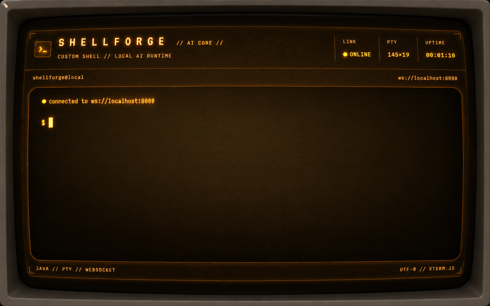

<sub>Main ShellForge terminal demonstrating core commands</sub>

</div>

<br/>

---

## ✨ Features

<table>
<tr>
<td width="50%" valign="top">

### 🐚 Shell engine
- Hand-written **quote / escape tokenizer**
- `$NAME` / `${NAME}` **variable expansion** + `declare`
- **Pipelines** — external *and* built-in stages
- **Redirection** — `>` `>>` `2>` `2>>` `1>` `1>>`
- **Background jobs** with `jobs` and auto-reaping
- **Persistent history** via `HISTFILE`
- **Custom TAB completion** with cycling and pluggable completer scripts

</td>
<td width="50%" valign="top">

### 🤖 Local AI &nbsp;·&nbsp; 🛠 Dev tools &nbsp;·&nbsp; 🌐 Web
- `ai` — natural language → shell command
- `ai execute` — run it after **y/N confirmation**
- `ai explain` / `ai fix`
- `project` / `project analyze` — metadata + AI summary
- `tree`, `findx`, `inspect`
- **Browser terminal**: React + xterm.js ↔ WebSocket ↔ PTY ↔ ShellForge
- Retro **amber CRT** look with scanlines and live status readouts

</td>
</tr>
</table>

> [!NOTE]
> All AI features run **locally** through [Ollama](https://ollama.com). The code makes no cloud API calls.

---

## 🚀 Quick Start

### Requirements

| Tool | Needed for | Notes |
|---|---|---|
| **JDK 26** | Everything | `pom.xml` sets `maven.compiler.release` to `26` |
| **Maven** | Building | |
| **Ollama** + `qwen2.5:3b` | `ai`, `project analyze` | Optional |
| **Node.js + npm** | Web terminal frontend | Optional |

> [!IMPORTANT]
> ShellForge is written for **macOS**. Windows has not been addressed in the code and is not claimed to work.

### Build & run the shell

```bash
git clone https://github.com/soumyaraofficial/ShellForge-JAVA.git
cd ShellForge-JAVA

mvn clean package                      # → target/shellforge-java.jar
java -jar target/shellforge-java.jar   # prompt: $
```

Optional: persist history between sessions (read from the **environment**):

```bash
HISTFILE=$HOME/.shellforge_history java -jar target/shellforge-java.jar
```

### Enable AI

```bash
ollama pull qwen2.5:3b     # make sure Ollama is listening on localhost:11434
```

### Launch the web terminal

```bash
# Terminal 1 — from the repository root (it launches target/shellforge-java.jar)
java -cp target/shellforge-java.jar WebServer     # ws://localhost:8080

# Terminal 2
cd frontend && npm install && npm run dev         # open the URL Vite prints
```

---

## 📖 Built-in Commands

ShellForge has exactly **14** built-ins, registered in `Builtins.java`.

| Command | Syntax | Description |
|---|---|---|
| `echo` | `echo [args...]` | Print arguments |
| `exit` | `exit` | Leave the shell (saves history if `HISTFILE` is set) |
| `type` | `type NAME` | Built-in, PATH location, or not found |
| `pwd` | `pwd` | Print current directory |
| `cd` | `cd PATH` &#124; `cd ~` | Change directory |
| `complete` | `complete -C SCRIPT CMD` &#124; `-p CMD` &#124; `-r CMD` | Manage external completers |
| `jobs` | `jobs` | List background jobs |
| `history` | `history [N \| -r F \| -w F \| -a F]` | Show / load / save history |
| `declare` | `declare [-p] [NAME[=VALUE] ...]` | Shell variables |
| `ai` | `ai Q` &#124; `ai execute Q` &#124; `ai explain C` &#124; `ai fix` | Local AI assistant |
| `project` | `project` &#124; `project analyze` | Project metadata / AI analysis |
| `tree` | `tree [PATH] [DEPTH]` &#124; `tree DEPTH` | Directory tree |
| `findx` | `findx TERM [DIR]` | Recursive text search |
| `inspect` | `inspect PATH` | File / directory statistics |

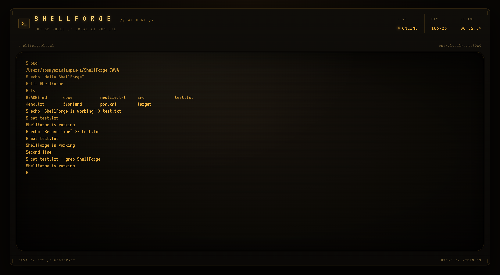

Anything else is looked up on `PATH` and run as an external program.

---

## 🧠 AI Assistant

Powered by **Ollama** · model **`qwen2.5:3b`** · `POST http://localhost:11434/api/generate`

| Mode | What it does | Runs anything? |
|---|---|---|
| `ai <question>` | Suggests one shell command | ❌ Never |
| `ai execute <question>` | Suggests a command, asks `Execute? [y/N]` | ✅ Only on `y` |
| `ai explain <command>` | Plain-language explanation of a command | ❌ Never |
| `ai fix` | Diagnoses the previous **command-not-found** error | ❌ Never |

<div align="center">

|                                                                                                       | |
|:-----------------------------------------------------------------------------------------------------:|:---:|
|         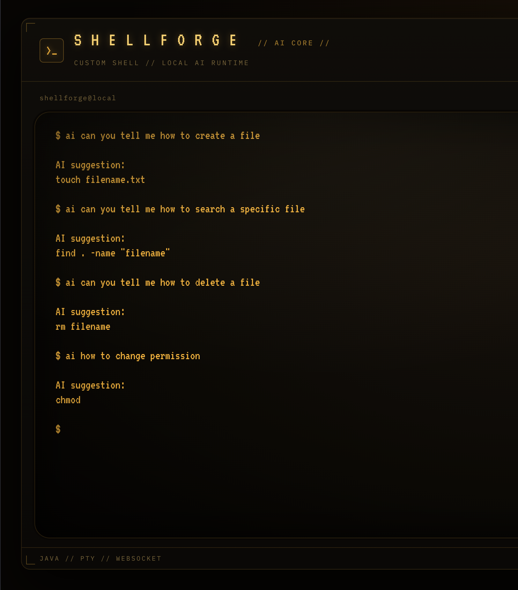<br/><sub><b>ai</b> — command generation</sub>           | 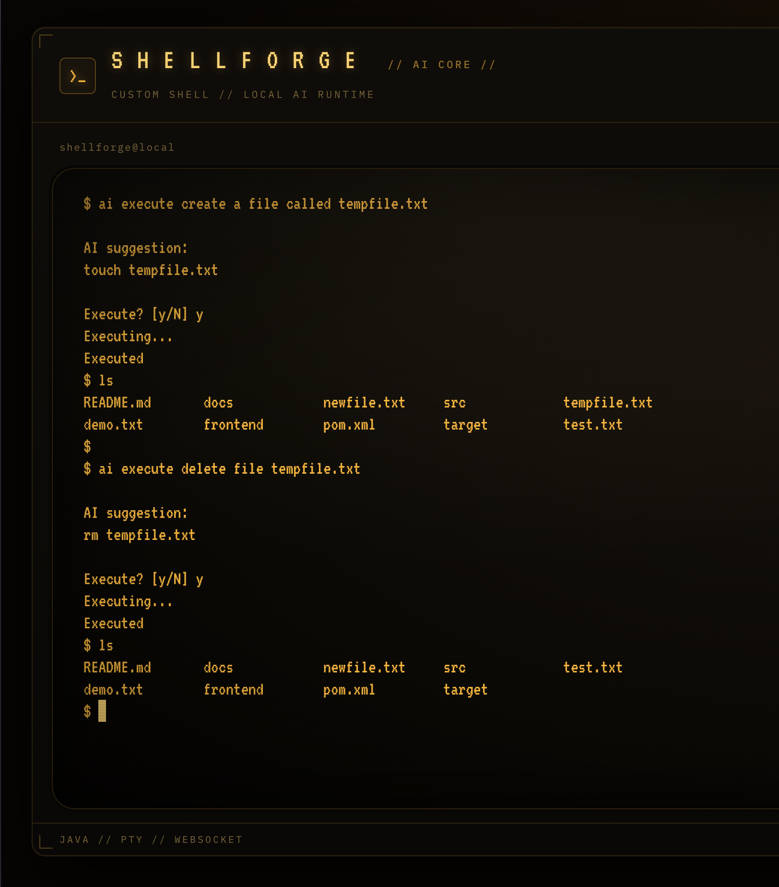<br/><sub><b>ai execute</b> — with confirmation</sub> |
| 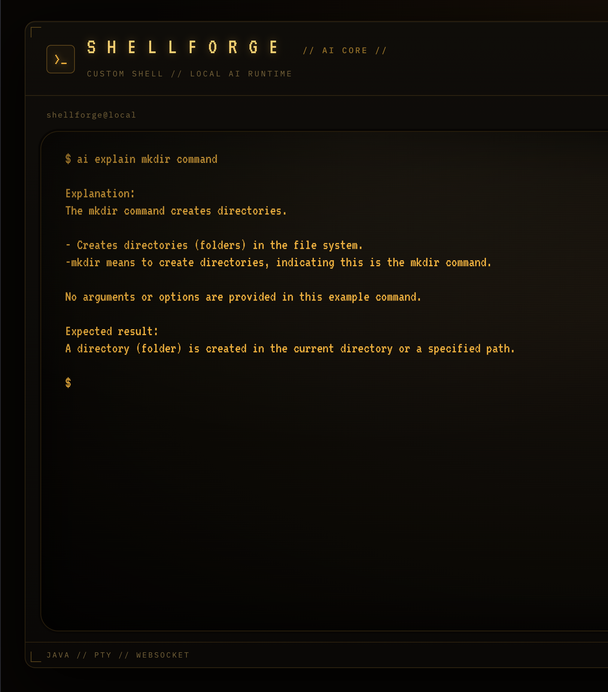<br/><sub><b>ai explain</b> — command explanation</sub> | 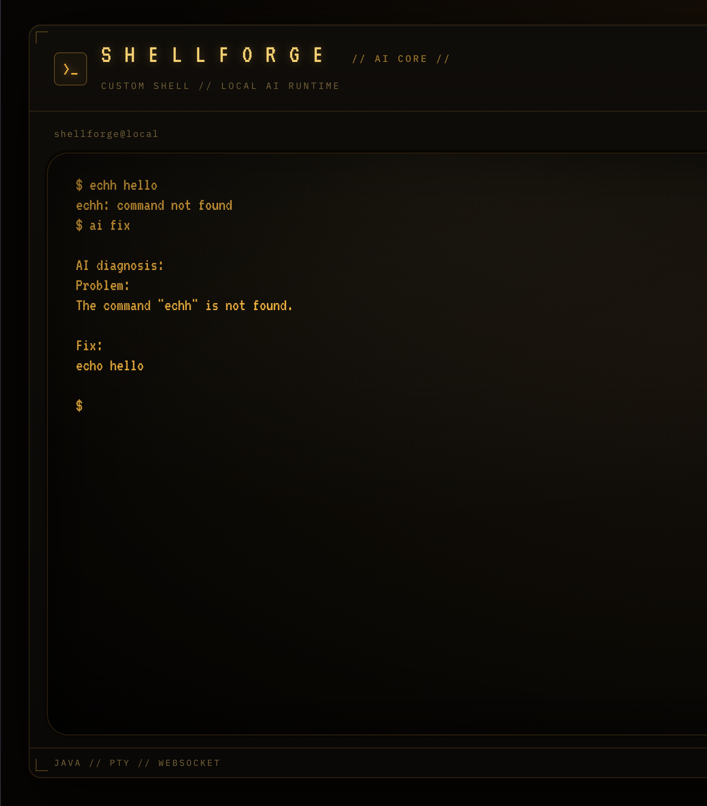<br/><sub><b>ai fix</b> — AI-assisted fixing</sub> |

</div>


```text
$ ai execute add mango to temp.txt

AI suggestion:
echo "mango" >> temp.txt

Execute? [y/N] y
Executing...
Executed
```
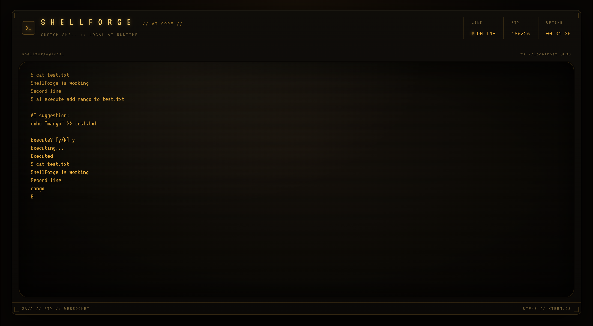
<details>
<summary><b>How each mode works (prompts, data sent, behavior)</b></summary>

<br/>

- **Request:** JSON with `model`, `system`, `prompt`, `"stream": false`, `"think": false`. Connect timeout 5 s, request timeout 2 min.
- **Parsing:** the `"response"` field is extracted by hand (no JSON library). Only `\n \r \t \" \\` escapes are decoded.
- **Data sent:** only the text listed below. No file contents, directory listing, OS name, or working directory.

| Mode | Sent as prompt | System prompt asks for |
|---|---|---|
| `ai` / `ai execute` | The words after `ai` / `ai execute` | *Only* the command — no explanation, no markdown |
| `ai explain` | The words after `explain` | What it does, what each argument means, expected result |
| `ai fix` | `Command: <last command>` + `Error: <last error>` | `Problem:` + `Fix:` — never executes |

**`ai execute` details**
- The AI text goes through the **full executor** (tokenizing, variables, pipes, redirection, PATH lookup).
- Anything other than `y` (or EOF) prints `Cancelled.` and discards the suggestion.
- `Executed` prints regardless of whether the command succeeded.
- A suggested `cd` does not persist (the returned directory is discarded).

**`ai fix` details**
- The last typed line is tracked by `CommandExecutor` (all lines except `ai fix` itself).
- `lastError` is set in exactly one place: a single, non-pipeline command that is **not found**. Other failures are not captured.
- Errors: `ai fix: no previous command found` / `ai fix: no error found`.

**Tip:** the shell parses the line *before* `ai` sees it, so quote commands containing operators:

```text
$ ai explain "ls -la | grep txt"
```

</details>

---

## 🗂 Project Intelligence

### `project`

Scans the current directory and prints a boxed summary plus a language breakdown.

<div align="center">
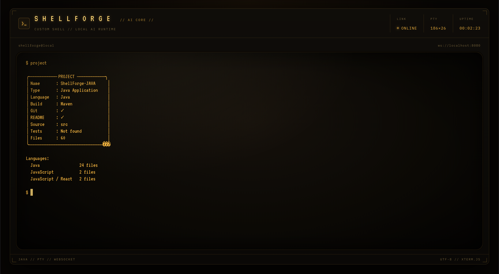<br/>
<sub>Project metadata scanning</sub>
</div>

| Field | How it's detected |
|---|---|
| **Name** | Directory name |
| **Type** | `pom.xml` → *Java Application*, `package.json` → *Node project*, `Cargo.toml`, `go.mod`, `pyproject.toml` / `requirements.txt`, `CMakeLists.txt`, else `<Language> Project` |
| **Language** | Language with the most files |
| **Build** | Maven, Gradle, npm, pip, Cargo, Go, CMake, Composer, Bundler, Swift PM |
| **Git / README** | `.git` directory · `README.md` or `README` |
| **Source / Tests** | First existing of `src, app, lib` · `src/test, tests, test, __tests__` |
| **Files** | Regular files, skipping `target`, `node_modules`, `.git`, `build`, `dist`, `.idea` |

### `project analyze`

```text
ProjectScanner → project metadata → Ollama (qwen2.5:3b) → developer-focused analysis
```

Sends **metadata only** (name, type, language, build tool, git/readme flags, directories, file counts, per-language counts) and asks for: project type, main technologies, likely architecture, build system, testing setup, and likely purpose — with an instruction not to invent anything. Markdown decoration is stripped from the reply.


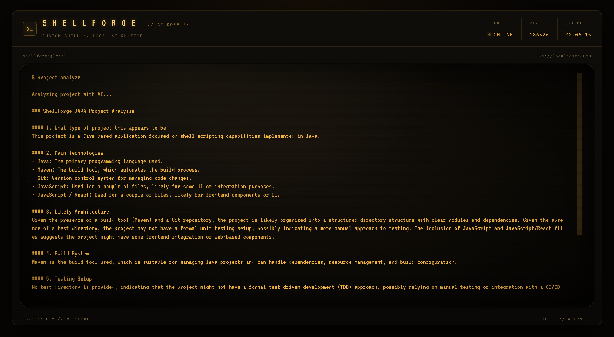 
<div align="center">
AI-assisted project analysis
</div>

> [!NOTE]
> The model never sees your code — only counts and flags — so the analysis will be fairly generic.

---

## 🔧 Developer Tools

<table>
<tr>
<td width="33%" valign="top">

### `tree`
```text
tree            # depth 5
tree 2          # depth 2
tree src        # path
tree src 3      # path + depth
```
Directories first, then files, case-insensitive sort, box-drawing branches.

</td>
<td width="33%" valign="top">

### `findx`
```text
findx TERM [DIR]
findx WebSocket
findx "history -a" src
```
Case-insensitive substring search with **line numbers** and a `N matches in M files` summary.

</td>
<td width="33%" valign="top">

### `inspect`
```text
inspect pom.xml
inspect src/main/java
```
File: type, size, lines, modified.<br/>
Directory: file/dir counts, total size, file-type breakdown.

</td>
</tr>
<tr>
<td align="center">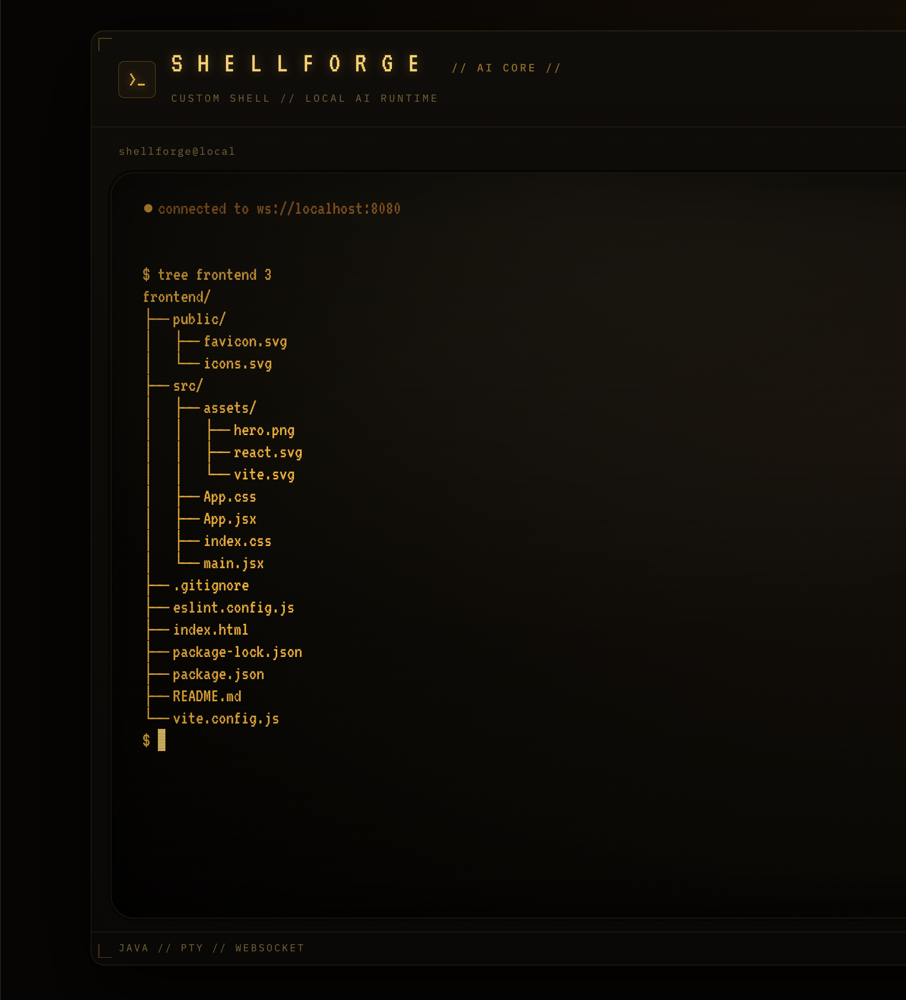</td>
<td align="center">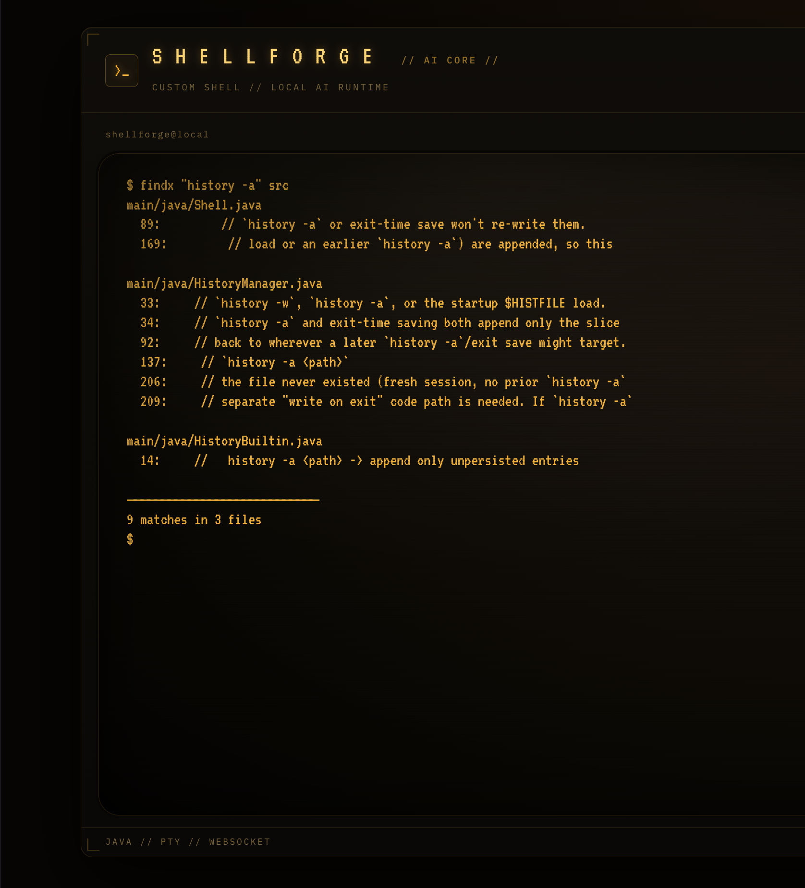</td>
<td align="center">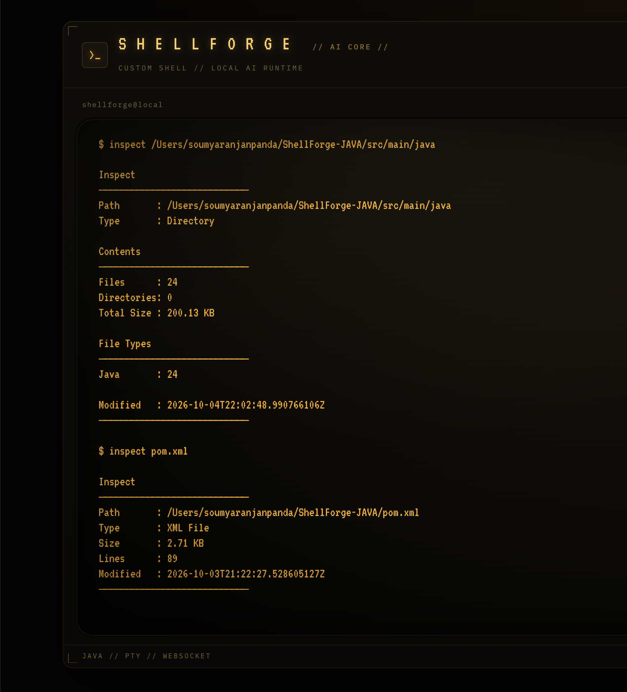</td>
</tr>
</table>


<details>
<summary><b>Details: ignored paths, searchable files, error messages</b></summary>

<br/>

- **Ignored directories (all three):** `.git`, `target`, `node_modules`, `build`, `dist`, `.idea`
- **`findx` searches:** `java js jsx ts tsx css html xml json md txt properties yml yaml sql sh` — files without an extension are skipped
- **`findx` skips lock files:** `package-lock.json`, `yarn.lock`, `pnpm-lock.yaml`, `composer.lock`, `Gemfile.lock`
- **`tree` errors:** `tree: depth must be a number`, `tree: directory not found: <path>`
- **`findx` errors:** `findx: missing search term`, `findx: directory not found: <path>`
- **`inspect` errors:** `inspect: missing file or directory`, `inspect: file or directory not found: <path>`

</details>

---

## 🐚 Shell Features

### Operators

| Operator | Meaning |
|---|---|
| <code>&#124;</code> | Pipe stdout of one stage into the next |
| `>` / `1>` | Redirect stdout (overwrite) |
| `>>` / `1>>` | Redirect stdout (append) |
| `2>` | Redirect stderr (overwrite) |
| `2>>` | Redirect stderr (append) |
| `&` | Run an external command in the background |
| `$NAME` / `${NAME}` | Expand a shell variable |

> Operators must be **separate, space-delimited tokens**: `echo hi > file` redirects, `echo hi>file` does not.

### Pipelines

```text
$ cat pom.xml | grep artifactId
$ echo "banana apple cherry" | tr ' ' '\n' | sort
$ ls -l | grep java > java-files.txt
```

- All stages are **validated before anything starts** (unknown command → nothing runs).
- External → external stages are connected by byte-pumping threads; built-in output is captured and fed to the next process.
- Only the **last** stage is waited on; stderr is never piped.
- Built-ins usable in a pipeline: `echo type pwd cd complete jobs history declare ai project tree`.

### Redirection

```text
$ echo first > log.txt
$ echo second >> log.txt
$ ls /no/such/dir 2> err.txt
$ ls /no/such/dir 2>> err.txt
```

Parent directories of the target are created automatically.

### Variables

```text
$ declare NAME=ShellForge
$ echo Welcome to $NAME
Welcome to ShellForge
$ declare -p NAME
declare -- NAME="ShellForge"
```

### Background jobs

```text
$ sleep 20 &
[1] 51234
$ jobs
[1]+  Running                 sleep 20 &
```

Finished jobs are reported as `Done` once, right before the next prompt. Job numbers are recycled (highest tracked + 1).

### History

| Command | Effect |
|---|---|
| `history` / `history N` | Show all / last N entries |
| `history -r FILE` | Read a file into in-memory history |
| `history -w FILE` | Overwrite file with full history |
| `history -a FILE` | Append only entries not yet persisted |

With `HISTFILE` set: loaded at startup, appended on `exit` / Ctrl-D. Duplicate writes are prevented by a persistence boundary.

### TAB completion

| Position | Behavior |
|---|---|
| **Command** | `PATH` executables + built-ins. One match completes with a space; common prefix extends; second TAB lists matches |
| **Argument** | Filenames (nested paths supported, directories get `/`). Ambiguous matches **cycle** on repeated TAB |
| **Custom** | `complete -C ./script.sh mytool` — the script is run as `script <cmd> <word> <prev>` with `COMP_LINE` / `COMP_POINT` set; each stdout line is a candidate |

---

## 🌐 Web Terminal

<div align="center">
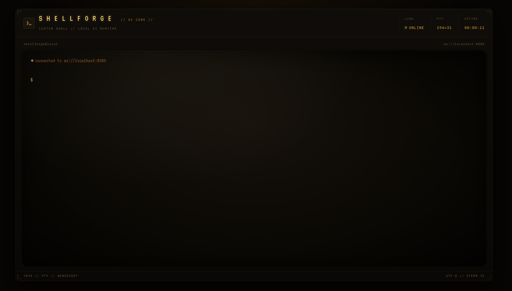<br/>
<sub>Retro browser-based terminal</sub>
</div>

<br/>

The browser runs **React + xterm.js**, which talks over a **WebSocket** to `WebServer`, which runs ShellForge inside a **PTY** (pty4j). Raw ANSI output is streamed to xterm.js, and keystrokes are written straight to the PTY — line editing, TAB and history are all handled by JLine inside the shell.

**Frontend details**
- xterm.js with **FitAddon**, VT323 font (size 20), 5000 lines of scrollback, custom 16-colour amber theme
- Header readouts: **LINK** (LINKING / ONLINE / OFFLINE), **PTY** size, **UPTIME**
- Effects present in the CSS: amber-on-black palette, **scanlines**, glass highlight + vignette, corner brackets, text glow, pulsing status LED
- Connects to `ws://localhost:8080` (hard-coded `WS_URL` in `App.jsx`)

> [!WARNING]
> **The web terminal is an unauthenticated shell.** `WebServer` binds `new InetSocketAddress(8080)` (all network interfaces), has no authentication, TLS, or Origin check, and **all connected browsers share one shell session** running with your user's privileges. Only run it on a trusted machine/network, or behind a firewall or tunnel.

Other behaviors: the PTY is fixed at 120×40 (browser resizes aren't forwarded), there's no frontend auto-reconnect, and an exited shell isn't restarted.

---

## 🏗 Architecture

### Overall

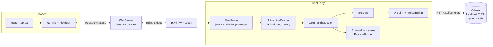
```mermaid
flowchart LR
    subgraph Browser
        R["React App.jsx"] --> X["xterm.js + FitAddon"]
    end
    X <-->|"WebSocket :8080"| WS["WebServer<br/>Java-WebSocket"]
    WS <-->|"stdin / stdout"| PTY["pty4j PtyProcess"]
    PTY --> SH["ShellForge<br/>java -jar shellforge-java.jar"]
    subgraph ShellForge
        SH --> JL["JLine LineReader<br/>TAB widget, history"]
        JL --> CE["CommandExecutor"]
        CE --> B["Built-ins"]
        CE --> EXT["External processes<br/>ProcessBuilder"]
        B --> AI["AIBuiltin / ProjectBuiltin"]
    end
    AI -->|"HTTP /api/generate"| OL[("Ollama<br/>localhost:11434<br/>qwen2.5:3b")]
```

### Command execution flow

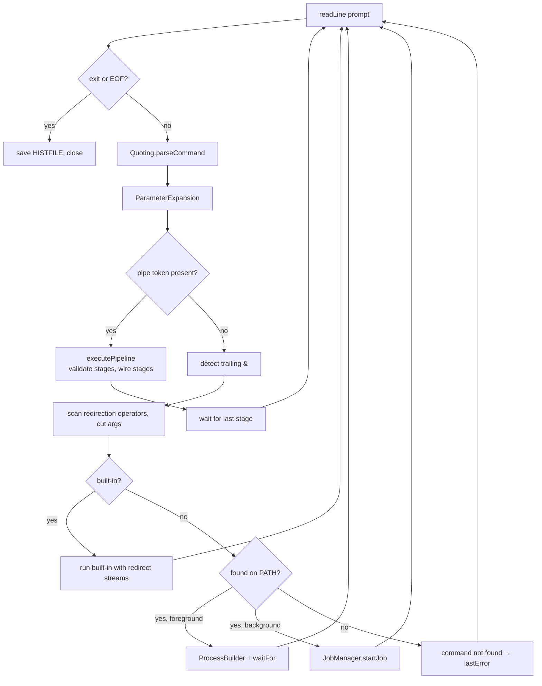
```mermaid
flowchart TD
    A["readLine prompt"] --> B{"exit or EOF?"}
    B -->|yes| Z["save HISTFILE, close"]
    B -->|no| C["Quoting.parseCommand"]
    C --> D["ParameterExpansion"]
    D --> E{"pipe token present?"}
    E -->|yes| P["executePipeline<br/>validate stages, wire stages"]
    E -->|no| F["detect trailing &"]
    F --> G["scan redirection operators, cut args"]
    G --> H{"built-in?"}
    H -->|yes| I["run built-in with redirect streams"]
    H -->|no| J{"found on PATH?"}
    J -->|"yes, foreground"| K["ProcessBuilder + waitFor"]
    J -->|"yes, background"| L["JobManager.startJob"]
    J -->|no| M["command not found → lastError"]
    P --> N["wait for last stage"]
    I --> A
    K --> A
    L --> A
    M --> A
    N --> A
```

### AI flow

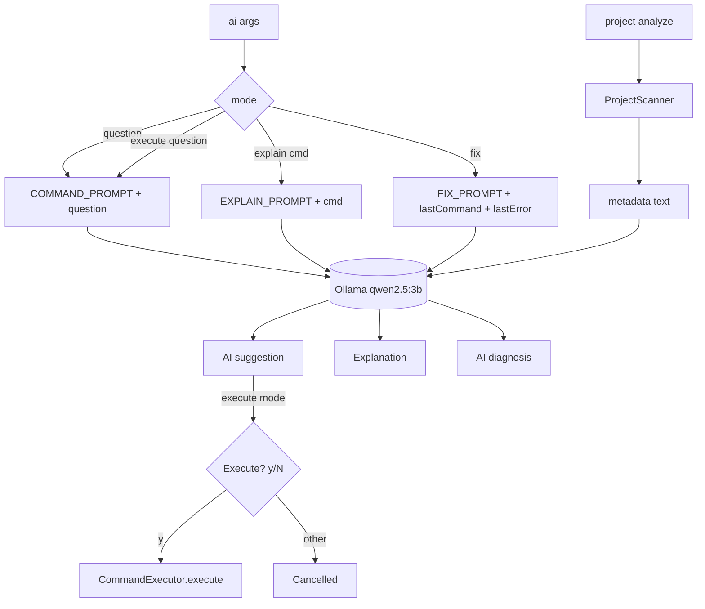
```mermaid
flowchart TD
    U["ai args"] --> M{"mode"}
    M -->|question| S1["COMMAND_PROMPT + question"]
    M -->|"execute question"| S1
    M -->|"explain cmd"| S2["EXPLAIN_PROMPT + cmd"]
    M -->|fix| S3["FIX_PROMPT + lastCommand + lastError"]
    S1 --> OL[("Ollama qwen2.5:3b")]
    S2 --> OL
    S3 --> OL
    OL --> R1["AI suggestion"]
    OL --> R2["Explanation"]
    OL --> R3["AI diagnosis"]
    R1 -->|"execute mode"| C{"Execute? y/N"}
    C -->|y| EX["CommandExecutor.execute"]
    C -->|other| CA["Cancelled"]
    PA["project analyze"] --> PS["ProjectScanner"] --> CTX["metadata text"] --> OL
```

### Web terminal sequence

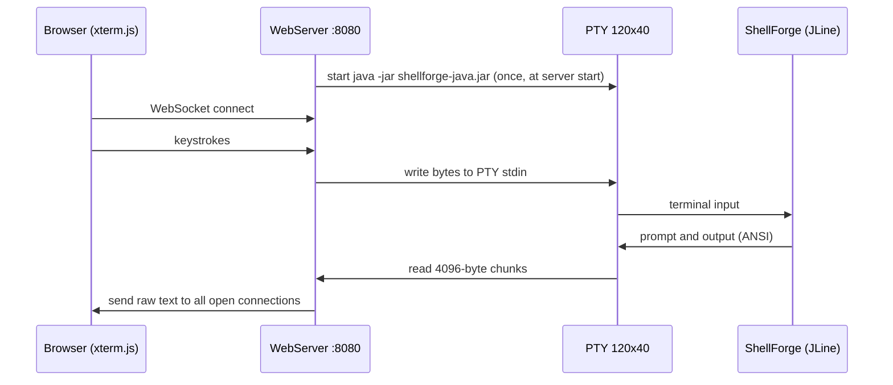
```mermaid
sequenceDiagram
    participant B as Browser (xterm.js)
    participant W as WebServer :8080
    participant P as PTY 120x40
    participant S as ShellForge (JLine)
    W->>P: start java -jar shellforge-java.jar (once, at server start)
    B->>W: WebSocket connect
    B->>W: keystrokes
    W->>P: write bytes to PTY stdin
    P->>S: terminal input
    S->>P: prompt and output (ANSI)
    P->>W: read 4096-byte chunks
    W->>B: send raw text to all open connections
```

---

## 🧰 Tech Stack

| Layer | Technology |
|---|---|
| **Language / build** | Java (release 26), Maven, `maven-compiler-plugin` 3.14.1, `maven-assembly-plugin` 3.7.1 (fat JAR) |
| **Line editing** | JLine 3.30.0 |
| **Shell engine** | Custom tokenizer, parameter expansion, executor, `JobManager`, `HistoryManager`, `ProcessBuilder` |
| **AI** | Ollama HTTP API, `qwen2.5:3b`, JDK `java.net.http.HttpClient` (no JSON library) |
| **Networking** | Java-WebSocket 1.6.0 |
| **PTY** | pty4j 0.13.12 |
| **Frontend** | React ^19.2.8, Vite ^8.3.0, `@xterm/xterm` ^6.0.0, `@xterm/addon-fit` ^0.11.0, ESLint ^10 |
| **Fonts** | VT323, IBM Plex Mono (Google Fonts) |

---

## 📁 Project Structure

```text
ShellForge-JAVA/
├── pom.xml
├── src/main/java/                  # default package
│   ├── Main.java                   # entry point → new Shell().run()
│   ├── Shell.java                  # JLine setup, prompt loop, job reaping, history load/save
│   ├── CommandExecutor.java        # parse, expand, pipelines, redirection, dispatch, processes
│   ├── Quoting.java                # tokenizer (quotes / escapes) + echo
│   ├── ParameterExpansion.java     # $NAME / ${NAME}
│   ├── ShellVariables.java         # variable store
│   ├── Builtins.java               # canonical built-in names
│   ├── DeclareBuiltin.java
│   ├── JobManager.java · JobsBuiltin.java
│   ├── HistoryManager.java · HistoryBuiltin.java
│   ├── FileNameCompleter.java      # the TAB widget in use
│   ├── CompleteBuiltin.java · CompletionRegistry.java · ExternalCompleter.java
│   ├── AIBuiltin.java              # ai / execute / explain / fix
│   ├── ProjectBuiltin.java · ProjectScanner.java   # (ProjectInfo is nested in the scanner)
│   ├── TreeBuiltin.java · FindxBuiltin.java · InspectBuiltin.java
│   ├── WebServer.java              # PTY + WebSocket backend
│   └── CommandCompletion.java      # earlier TAB widget — currently unused
├── frontend/
│   ├── package.json · vite.config.js · index.html
│   └── src/
│       ├── App.jsx                 # xterm.js, WebSocket client, status readouts
│       ├── App.css                 # amber CRT styling
│       └── main.jsx
└── docs/screenshots/               # ← put your screenshots here
```

---

## ⚠️ Limitations

<details>
<summary><b>Shell engine</b></summary>

<br/>

- Not supported: `<` input redirection, `2>&1`, `;`, `&&`, `||`, globbing, command substitution, here-docs, functions, scripts, aliases, `export`, `$?`.
- No exit-status tracking.
- Quote information is lost after tokenizing, so a quoted standalone `"|"` or `">"` still acts as an operator.
- Shell variables aren't environment variables: they aren't exported to child processes, and `$HOME` / `$PATH` don't expand.
- Single quotes do **not** prevent `$VAR` expansion.
- Built-in names are case-sensitive at dispatch (`ECHO` is not the built-in).
- `exit` works only as the whole line; `exit 3` is not handled.
- `cd` supports a path or exactly `~` (no `cd -`, no `~/sub`, no bare `cd` to HOME).

</details>

<details>
<summary><b>Pipelines, jobs and output</b></summary>

<br/>

- No background pipelines (`&` is dropped, pipeline runs in the foreground).
- `findx` and `inspect` can't be used inside a pipeline.
- Inside a pipeline, `tree` always uses depth 3 and `project` ignores `analyze`; `cd` never changes the shell's directory.
- `tree`, `findx`, `inspect`, `project` print straight to the terminal — **their output can't be redirected or piped**.
- A first-stage external command doesn't receive terminal stdin.
- Jobs: no `fg` / `bg` / `kill`, no exit codes, no Stopped state.
- TAB command names come from a `PATH` snapshot taken at startup.

</details>

<details>
<summary><b>AI</b></summary>

<br/>

- Requires a running Ollama with `qwen2.5:3b`; the URL and model are constants (no config override).
- `ai execute` runs model output after a y/N prompt — it is **not validated or sandboxed**. Read the suggestion before answering `y`.
- A 3B model can be wrong; prompts include no OS / directory / file context.
- `ai fix` only handles *command-not-found* on a single (non-pipeline) command, and never runs the fix.
- `project analyze` has no HTTP timeout, so it can wait indefinitely if Ollama stalls.

</details>

<details>
<summary><b>Web terminal & platform</b></summary>

<br/>

- Unauthenticated, no TLS / Origin check, binds all interfaces, one shared session (see the warning above).
- Fixed 120×40 PTY, no resize forwarding, no reconnect, no shell restart.
- Output is decoded per 4096-byte read, so a multi-byte UTF-8 character split across reads could render incorrectly.
- Unix-oriented (PATH lookup, `/`-based ignore rules, `java.home/bin/java`).
- The repository contains no automated tests.

</details>

---

## 🗺 Roadmap

**Currently implemented:** everything described above.

**Ideas (not implemented):**

- [ ] Configurable Ollama URL and model
- [ ] Real JSON parsing for Ollama responses
- [ ] Exit-status tracking (`$?`, `&&`, `||`) and richer `ai fix` error capture
- [ ] `<` input redirection and `2>&1`
- [ ] Loopback-only binding + auth / Origin checks for the web terminal
- [ ] Per-connection PTY sessions and resize forwarding
- [ ] Frontend auto-reconnect
- [ ] Redirectable / pipeable `tree`, `findx`, `inspect`, `project`
- [ ] `fg` / `bg` / `kill` job control
- [ ] Unit tests for `Quoting`, `ParameterExpansion`, and the executor

---

<div align="center">

**Built by [@soumyaraofficial](https://github.com/soumyaraofficial)**

<sub>Java · JLine · Ollama · pty4j · React · xterm.js</sub>

</div>
